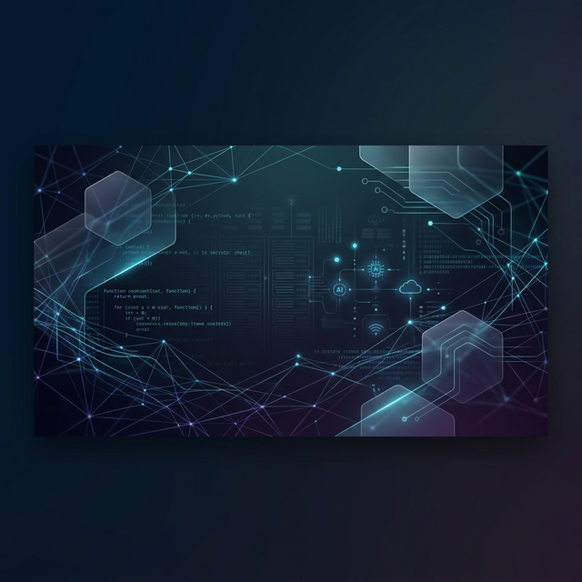
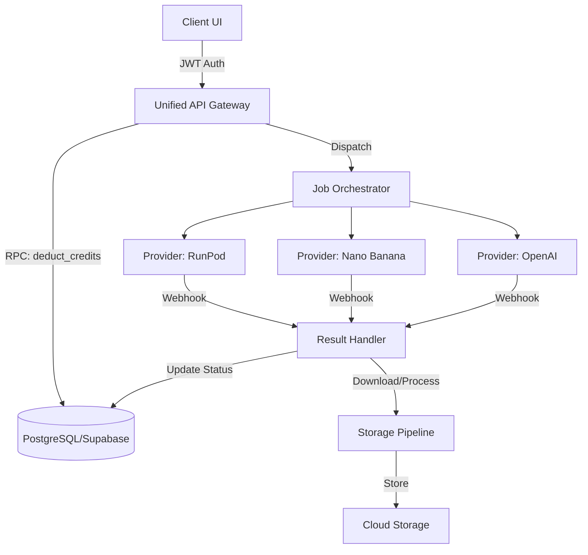

  

<h1 align="center">Utkarsh Singh</h1>

  <b>Full Stack Engineer • Backend Systems Architect • AI Integration Specialist</b>

  
  
  

---

### 🏛️ Engineering Philosophy
I design and build production-grade systems where **scalability, reliability, and security** are first-class citizens. My approach focuses on modular architectures that handle real-world complexities—such as atomic state management in distributed systems, high-throughput AI pipelines, and real-time media orchestration.

- **Distributed Systems:** Designing for eventual consistency and high availability.
- **AI Infrastructure:** Scaling LLM and Generative AI workflows with robust job orchestration.
- **Cloud Native:** Leveraging serverless and containerized environments for elastic scaling.
- **Security First:** Implementing Row Level Security (RLS), encrypted storage, and secure identity linking.

---

### 💻 Technical Stack

<b>Languages & Core</b>

  
  
  
  
  

<b>Backend & Infrastructure</b>

  
  
  
  
  
  

---

### 🚀 Featured Architectural Projects

> [!TIP]
> **Technical Deep Dive:** For a comprehensive breakdown of my engineering principles and system design patterns, check out the [**ARCHITECTURE.md**](./ARCHITECTURE.md) guide.

#### 1. StudioX — Enterprise AI Media Generation Engine
A full-stack orchestration platform for scalable image and video generation workflows, handling the complete lifecycle from prompt to persistent storage.

**Technical Deep Dive:**
- **Unified API Gateway:** Implemented a consolidated gateway handling authentication, routing, and job orchestration, reducing architectural complexity.
- **Atomic Credit Ledger:** Developed a fail-safe credit system using PostgreSQL RPCs to ensure atomic transactions between job creation and balance deduction, preventing race conditions.
- **Distributed Job Orchestration:** Built a provider-agnostic engine that interfaces with RunPod, Nano Banana, and OpenAI, including robust webhook normalization.
- **Media Pipeline:** A secure, server-side pipeline that fetches transient provider outputs, processes them, and stores them in private cloud buckets to ensure 100% data durability.

---

#### 2. Vibie — High-Throughput Music Streaming Platform
A scalable audio delivery system designed for low-latency streaming and automated media processing.

**Technical Highlights:**
- **Transcoding Pipeline:** Leveraged FFmpeg for high-fidelity audio processing and multi-format transcoding.
- **Streaming Optimization:** Implemented chunked delivery and byte-range request support for seamless playback across variable network conditions.
- **Metadata Indexing:** Optimized PostgreSQL schema for real-time track indexing and lightning-fast search capabilities.

---

#### 3. VaultX — Secure Anonymous File Distribution
An ephemeral file-sharing system optimized for high-performance uploads and secure, encrypted distribution.

**Technical Highlights:**
- **Distributed File Shredding:** Implemented upload chunking to handle multi-gigabyte files efficiently over standard HTTP.
- **Lifecycle Management:** Automated expiration-based file cleanup with secure, deterministic download endpoints.
- **Infrastructure:** Designed to scale horizontally using serverless compute (Cloud Run) and object storage.

---

### 📈 GitHub Metrics

  
  

---

### ⚡ Real-Time & Event-Driven Systems
Experienced in building high-concurrency applications using:
- **WebSockets & Socket.IO** for bi-directional live updates.
- **Firestore Realtime Listeners** for seamless UI synchronization.
- **Event-Driven Architectures** utilizing Pub/Sub and Message Queues for asynchronous processing.

---

### 📫 Let's Connect
I'm always open to discussing system design, AI architectures, or full-stack engineering.

- 📧 **Email:** [hello@utkarsh-singh.dev](mailto:hello@utkarsh-singh.dev)
- 💼 **LinkedIn:** [linkedin.com/in/utkarsh-singh](https://linkedin.com/in/utkarsh-singh)
- 🌍 **Web:** [utkarsh-singh.dev](https://utkarsh-singh.dev)

---

  <i>"The best systems are the ones that work so well, they become invisible."</i>

